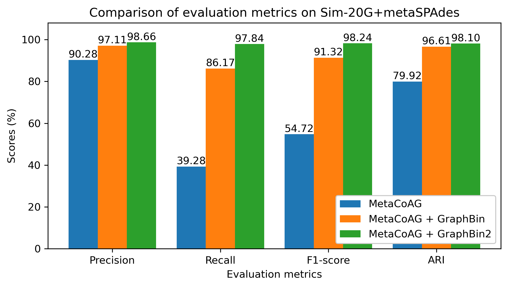

## Evaluating binning results

You can use the `evaluate` subcommand to evaluate your binning results given a ground truth.

Run `gbintk evaluate --help` or `gbintk evaluate -h` to list the help message for evaluation.

```shell
Usage: gbintk evaluate [OPTIONS]

  Evaluate the binning results given a ground truth

Options:
  --binned PATH            path to the .csv file with the initial binning
                           output from an existing tool  [required]
  --groundtruth PATH       path to the .csv file with the ground truth
                           [required]
  --delimiter [,|;|     |" "]  delimiter for input/output results. Supports a
                           comma (,), a semicolon (;), a tab ($'\t'), a space
                           (" ") and a pipe (|)  [default: ,]
  --output PATH            path to the output folder  [required]
  -h, --help               Show this message and exit.
```

### Input Format

`visualise` subcommand takes in 2 files as inputs.

* Binning result containing the comma separated records of `contig id,bin number` (in `.csv` format)
* Ground truth annotations containing the comma separated records of `contig id, groud truth bin` (in `.csv` format)

### Example Usage

```shell
gbintk evaluate --binned /path/to/binning_res.csv --groundtruth /path/to/grouhdtruth.csv --output /path/to/output_folder
```

### Output

You will get a file named `evaluation_results.txt` that contains the confusion matrix and the evaluation metrics precition, recall, F1-score and adjusted rand index (ARI). 

Please refer to the supplementary material of the [GraphBin publication](https://doi.org/10.1093/bioinformatics/btaa180) for further details on the confusion matrix and the evaluation metrics.

### Plotting Evaluation Results

You can use the evaluation results calculated for an initial binning result and a refined binning result to plot and compare. Following is an example code using the results obtained for the `5G_metaSPAdes` test dataset.

```python
import matplotlib.pyplot as plt
import numpy as np

metrics = ("Precision", "Recall", "F1-score", "ARI")

tools_means = {
    'MetaCoAG': (93.204, 37.721, 53.706, 84.173),
    'MetaCoAG + GraphBin': (100.0, 97.642, 98.807, 100.0),
}

# Prepare the data
tool_names = list(tools_means.keys())
tool_data = list(tools_means.values())
n_metrics = len(metrics)
n_tools = len(tool_names)

# X-axis values
indices = np.arange(n_metrics)  # the label locations
bar_width = 0.35  # the width of the bars

# Plotting
fig, ax = plt.subplots(figsize=(7, 4))  # Adjust the figure size here (width, height)

for i, (tool_name, tool_scores) in enumerate(tools_means.items()):
    bars = ax.bar(indices + i * bar_width, tool_scores, bar_width, label=tool_name)
    
    # Adding annotations on top of bars
    for bar in bars:
        yval = bar.get_height()
        ax.text(bar.get_x() + bar.get_width() / 2, yval, f'{yval:.2f}', 
                ha='center', va='bottom', fontsize=10)

# Add some text for labels, title and custom x-axis tick labels, etc.
ax.set_xlabel('Metrics')
ax.set_ylabel('Scores')
ax.set_title('Comparison of evaluation metrics on Sim-5G+metaSPAdes')
ax.set_xticks(indices + bar_width / 2)
ax.set_xticklabels(metrics)
ax.set_ylim(0, 108)
ax.legend(loc="lower right", framealpha=1)

# Show the plot
plt.tight_layout()
plt.savefig("gbintk_metrics_comparison.png", dpi=300)

```


