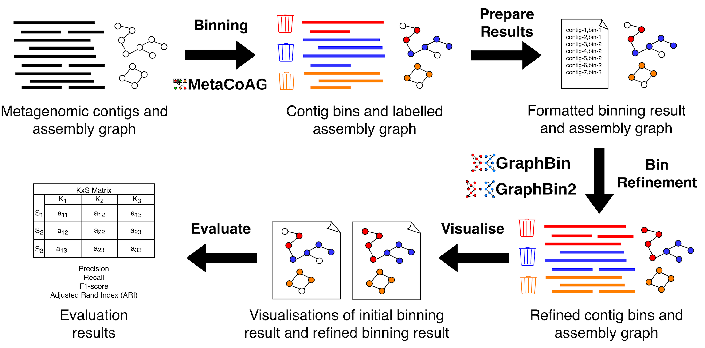

# GraphBin-Tk: assembly graph-based metagenomic binning toolkit

GraphBin-Tk combines assembly graph-based metagenomic bin-refinement and binning techniques [GraphBin](https://github.com/metagentools/GraphBin), [GraphBin2](https://github.com/metagentools/GraphBin2) and [MetaCoAG](https://github.com/metagentools/MetaCoAG) along with support functionality to visualise and evaluate results, into one comprehensive toolkit.



## Available commands

Run `gbintk --help` or `gbintk -h` to list the help message for GraphBin-Tk.

```shell
Usage: gbintk [OPTIONS] COMMAND [ARGS]...

  gbintk (GraphBin-Tk): Assembly graph-based metagenomic binning toolkit

Options:
  -v, --version  Show the version and exit.
  -h, --help     Show this message and exit.

Commands:
  graphbin   GraphBin: Refined Binning of Metagenomic Contigs using...
  graphbin2  GraphBin2: Refined and Overlapped Binning of Metagenomic...
  metacoag   MetaCoAG: Binning Metagenomic Contigs via Composition,...
  prepare    Format the initial binning result from an existing binning tool
  visualise  Visualise binning and refinement results
  evaluate   Evaluate the binning results given a ground truth
```