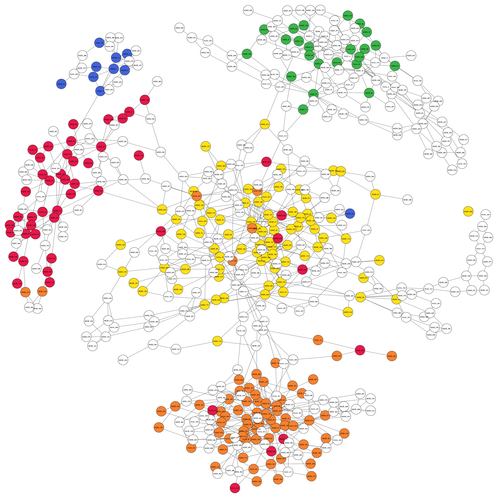

# Visualising binning results

You can use the `visualise` subcommand to visualise the binning results by denoting coloured contigs in the assembly graph according to their corresponding bins. You can visualise the initial binning result obtained from an existing binning tool and the final binning result obtained from GraphBin/GraphBin2 for comparison.

Run `gbintk visualise --help` or `gbintk visualise -h` to list the help message for visualisation.

```shell
Usage: gbintk visualise [OPTIONS]

  Visualise binning and refinement results

Options:
  --assembler [spades|megahit|flye]
                                  name of the assembler used (SPAdes, MEGAHIT
                                  or Flye)  [required]
  --initial PATH                  path to the initial binning result
                                  [required]
  --final PATH                    path to the final binning result  [required]
  --graph PATH                    path to the assembly graph file  [required]
  --contigs PATH                  path to the contigs file  [required]
  --paths PATH                    path to the contigs.paths (metaSPAdes) or
                                  assembly.info (metaFlye) file
  --output PATH                   path to the output folder  [required]
  --prefix TEXT                   prefix for the output file
  --dpi INTEGER                   dpi value  [default: 300]
  --width INTEGER                 width of the image in pixels  [default:
                                  2000]
  --height INTEGER                height of the image in pixels  [default:
                                  2000]
  --vsize INTEGER                 size of the vertices  [default: 50]
  --lsize INTEGER                 size of the vertex labels  [default: 8]
  --margin INTEGER                margin of the figure  [default: 50]
  --imgtype [png|eps|pdf|svg]     type of the image (png, eps, pdf, svg)
                                  [default: png]
  --delimiter [comma|tab]         delimiter for input/output results. Supports
                                  a comma and a tab.  [default: comma]
  -h, --help                      Show this message and exit.
```

## Input Format

The *metaSPAdes* version takes in 4 files as inputs.

* A delimited text file containing the initial binning result (e.g. `<contig_id>,<bin_number>` in `.csv` format)
* A delimited text file containing the refined binning result (e.g. `<contig_id>,<bin_number>` in `.csv` format)
* Assembly graph file (in `.gfa` format)
* Contigs file (in `.fasta` format)
* Contig paths file (in `.paths` format)

The *MEGAHIT* version takes in 3 files as inputs.

* A delimited text file containing the initial binning result (e.g. `<contig_id>,<bin_number>` in `.csv` format)
* A delimited text file containing the refined binning result (e.g. `<contig_id>,<bin_number>` in `.csv` format)
* Assembly graph file (in `.gfa` format)
* Contigs file (in `.fasta` format)

The *Flye* version takes in 4 files as inputs.

* A delimited text file containing the initial binning result (e.g. `<contig_id>,<bin_number>` in `.csv` format)
* A delimited text file containing the refined binning result (e.g. `<contig_id>,<bin_number>` in `.csv` format)
* Assembly graph file (`assembly_graph.gfa`)
* Contigs file (`assembly.fasta`)
* Contig paths file (`assembly_info.txt`)

## Example Usage

```shell
# SPAdes assembly available in tests/data/
gbintk visualise --assembler spades --initial tests/data/5G_metaSPAdes/metacoag_res.csv --final tests/data/5G_metaSPAdes/graphbin_res.csv --graph tests/data/5G_metaSPAdes//assembly_graph_with_scaffolds.gfa --contigs tests/data/5G_metaSPAdes//contigs.fasta --paths tests/data/5G_metaSPAdes/paths_file.paths --output tests/data/5G_metaSPAdes/visualise_results

# MEGAHIT assembly available in tests/data/
gbintk visualise --assembler megahit --initial tests/data/5G_MEGAHIT/initial_contig_bins.csv --final tests/data/5G_MEGAHIT/graphbin_output.csv --graph tests/data/5G_MEGAHIT/final.gfa --contigs tests/data/5G_MEGAHIT/final.contigs.fa --output tests/data/5G_MEGAHIT/visualise_results

# Flye assembly available in tests/data/
gbintk visualise --assembler flye --initial tests/data/1Y3B_Flye/initial_contig_bins.csv --final tests/data/1Y3B_Flye/graphbin_output.csv --graph tests/data/1Y3B_Flye/assembly_graph.gfa --contigs tests/data/1Y3B_Flye/assembly.fasta --paths tests/data/1Y3B_Flye/assembly_info.txt --output tests/data/1Y3B_Flye/visualise_results
```

## Output

The following outputs will be generated by the `visualise` subcommand.

* Figure of the assembly graph with the initial binning result
* Figure of the assembly graph with the refined binning result

## Example visualisation

**Initial binning result from MetaCoAG**



**Final refined binning result from GraphBin**

