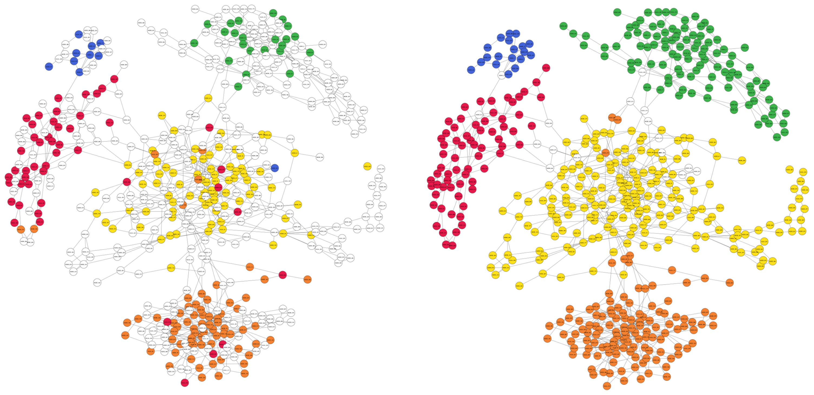

# Summary

The study of genetic material directly obtained from natural environments, termed metagenomics, offers valuable insights into microbial communities and their impact on human health and environmental dynamics [@Edwards:2013; @Pargin:2023]. Once the genetic material is extracted, sequenced to obtain reads and assembled to obtain contigs, a process known as metagenomic binning is used to cluster these contigs into bins that represent different taxonomic groups which results in draft genomes metagenome-assembled genomes (MAGs) [@Mallawaarachchi:2024]. Several automated metagenomic binning tools have been introduced in the past few decades which have led to the discovery of many novel micro-organisms and their characterisation [CITE].

Traditional metagenomic binning tools make use of features such as nucleotide composition and abundance information of contigs, yet find it challenging to bin sequences of closely related species and sequences having noisy features. Binning tools such as MetaCoAG [@Mallawaarachchi1:2022; @Mallawaarachchi2:2022] that use metagenome assembly graphs (a structure containing the connectivity information of contigs) are gaining popularity due to their improved binning results over traditional binning methods. Moreover, assembly graph-based bin refinement tools such as GraphBin [@Mallawaarachchi1:2020] and GraphBin2 [@Mallawaarachchi:2020; @Mallawaarachchi:2021] have been introduced to refine binning results from existing binning tools. Yet, these tools exist as individual software and running them individually can be complex, time-consuming and less intuitive. Here we present GraphBin-Tk, an assembly graph-based metagenomic binning tool that combines the capabilities of MetaCoAG, GraphBin and GraphBin2, along with additional pre-processing and post-processing functionality into one comprehensive toolkit (\autoref{fig1}). GraphBin-Tk is hosted at [https://github.com/metagentools/gbintk](https://github.com/metagentools/gbintk).

{width=100%}

# Statement of need

In metagenomic studies, it is crucial to obtain accurate binning results to understand the composition and functional potential of microbial communities. Traditional binning methods that rely on nucleotide composition and abundance features of contigs face several challenges when binning complex datasets [@Mallawaarachchi:2024]:

* Contigs of closely related species can be merged, producing contaminated bins.
* Contigs that have features that deviate from their constituent genomes (e.g., the presence of protein-coding regions and repeat regions) can be placed in the wrong bin.
* Contigs that are too short can be discarded as they may not capture enough genomic signatures.
* Contigs shared among different genomes are only placed in the bin of the most representative genome.

To address these challenges, GraphBin-Tk integrates the capabilities of GraphBin [@Mallawaarachchi1:2020], GraphBin2 [@Mallawaarachchi:2020; @Mallawaarachchi:2021] and MetaCoAG [@Mallawaarachchi1:2022; @Mallawaarachchi2:2022], providing a comprehensive toolkit for metagenomic binning and refinement. GraphBin-Tk unifies three state-of-the-art binning solutions in just one tool, making it easy to install and execute. It provides users with a more comprehensive set of features and capabilities, enabling them to perform a wider range of tasks related to metagenomic binning without needing additional software. This also eliminates the compatibility issues of having to run separate software and enhances the user experience by making the software easier to learn and use.

GraphBin-Tk can perform stand-alone metagenomic binning using MetaCoAG and bin refinement can be done either using GraphBin or GraphBin2. Additionally, pre-processing and post-processing functionalities to run these tools and to analyse the produced results are included in GraphBin-Tk. A list of the subcommands provided in GraphBin-Tk is as follows:

| Subcommand  | Tool/processing functionality                              | Inputs required                                                                                 |
|-------------|------------------------------------------------------------|-------------------------------------------------------------------------------------------------|
| `graphbin`  | Bin refinement tool GraphBin                               | Contigs, assembly graph file(s)\*, initial binning result                                       |
| `graphbin2` | Bin refinement tool GraphBin2                              | Contigs, assembly graph file(s)\*, initial binning result, coverage of contigs                  |
| `metacoag`  | Binning tool MetaCoAG                                      | Contigs, assembly graph file(s)\*, coverage of contigs                                          |
| `prepare`   | Format initial binning results for GraphBin and GraphBin2  | Folder containing the initial binning result                                                    |
| `visualise` | Visualise initial and refined binning results on the assembly graph | Assembly graph file(s), initial binning result, final binning result                            |
| `evaluate`  | Evaluate binning results given a ground truth              | Binning result, ground truth                                                                     |

\* The assembly graph files can vary depending on the assembler used to generate the contigs.

GraphBin-Tk supports metagenome assemblies generated from three popular metagenome assemblers; metaSPAdes [@Nurk:2017] and MEGAHIT [@Li:2015] for short-read sequencing data and metaFlye [@Kolmogorov:2020] for long-read sequencing data. GraphBin-Tk can be launched using the command `gbintk`. A user can start the analysis by running the `metacoag` subcommand to bin a metagenomic dataset and obtain MAGs as shown in \autoref{fig1}. The inputs required are the contigs file, the assembly graph files and the read coverage of contigs. The read coverage of contigs can be obtained by running a coverage calculation tool such as Koverage [@Roach:2024]. The MetaCoAG binning result can be formatted using the `prepare` subcommand into a .csv file that represents each contig and its bin name. This formatted binning result can be provided to either GraphBin or GraphBin2 using the subcommands `graphbin` or `graphbin2` along with the contigs file, the assembly graph files and the read coverage of contigs (refer to \autoref{fig1}). 

The initial MetaCoAG binning result and the refined binning result can be visualised on the assembly graph using the `visualise` subcommand as shown in \autoref{fig2}. Finally, the produced binning results can be evaluated in terms of metrics such as precision, recall, F1-score and adjusted rand index (ARI) [@Meyer:2018; @Mallawaarachchi1:2020] using the `evaluate` subcommand by providing the ground truth bins of contigs. This is possible only for simulated or mock metagenomes where you know which contig belongs to which genome.

{width=100%}

# Availability

GraphBin-Tk is distributed as a Conda package available in the Bioconda channel [@Gruning:2018] at [LINK]. GraphBin-Tk is also available as a Python package on PyPI at [LINK]. The source code is available on GitHub at [https://github.com/metagentools/gbintk](https://github.com/metagentools/gbintk) and features continuous integration, testing coverage, and continuous deployment using GitHub actions.

# Acknowledgements

This work is dedicated to the memory of the late Dr Yu Lin (The Australian National University) who was the PhD advisor of VM and AW, and whose guidance and support were instrumental in shaping the original work. His wisdom and mentorship will be deeply missed. 

This work was undertaken with the assistance of resources and services from the National Computational Infrastructure (NCI Australia) which is supported by the Australian Government. This work was supported by an Essential Open Source Software for Science Grant [GRANT#] from the Chan Zuckerberg Initiative.

# References

