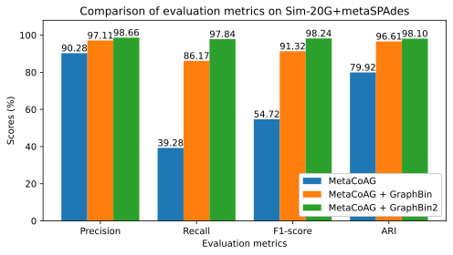

# Summary

The study of genetic material directly obtained from natural environments, termed metagenomics, offers valuable insights into microbial communities and their impact on human health and environmental dynamics [@Edwards:2013; @Pargin:2023]. Once the genetic material is extracted, sequenced to obtain reads and assembled to obtain contigs, a process known as metagenomic binning is used to cluster contigs into bins that represent different taxonomic groups which results in draft microbial genomes or metagenome-assembled genomes (MAGs) [@Mallawaarachchi:2024]. Several automated metagenomic binning tools incorporating novel computational methods have been introduced [@Alneberg:2014; @Wu:2015; @Kang:2019; @Xue:2022; @Chandrasiri:2022; @Pan:2023; @Xue:2024] which have led to the discovery and characterisation of many novel micro-organisms [@Brooks:2017; @Kang:2024].

Conventional metagenomic binning tools make use of features such as nucleotide composition and abundance information of contigs, yet find it challenging to bin closely related species and contigs that have noisy features. Binning tools, such as MetaCoAG [@Mallawaarachchi1:2022; @Mallawaarachchi2:2022] that use assembly graphs (a structure containing the connectivity information of contigs) are gaining popularity due to their improved binning results over conventional binning methods. Moreover, assembly graph-based bin refinement tools such as GraphBin [@Mallawaarachchi1:2020] and GraphBin2 [@Mallawaarachchi2:2020; @Mallawaarachchi:2021] have been introduced to refine binning results from existing binning tools. Yet, these tools exist as individual software and running them individually can be complex, time-consuming and less accessible. Here we present GraphBin-Tk, an assembly graph-based metagenomic binning tool that combines the capabilities of MetaCoAG, GraphBin and GraphBin2, along with additional pre-processing and post-processing functionality into one comprehensive toolkit. GraphBin-Tk is hosted at [https://github.com/metagentools/gbintk](https://github.com/metagentools/gbintk).

# Statement of need

It is crucial to obtain accurate binning results in metagenomic studies to understand the composition and functional potential of microbial communities. Conventional binning methods mainly rely on two features of contigs; 1) nucleotide composition, represented as normalised frequencies of oligonucleotides (short substrings of a particular length) and 2) abundance, the average number of reads that covers each nucleotide base of the contig [@Woodcroft:2017; @Roach:2024]. Previous studies have found that these tools face several challenges when binning complex datasets, especially those containing closely related species, short contigs, and shared genomic regions [@Mallawaarachchi:2024].

To address these challenges, several graph-based metagenomic binning tools [@Mallawaarachchi:2024] such as MetaCoAG [@Mallawaarachchi1:2022; @Mallawaarachchi2:2022] and GraphMB [@Lamurias:2022], and bin refinement tools such as GraphBin [@Mallawaarachchi1:2020] and GraphBin2 [@Mallawaarachchi2:2020; @Mallawaarachchi:2021] have been developed. These tools enhance the binning results by leveraging the connectivity information of the assembly graph -- an intermediate output generated from the assembly process, that is often discarded during downstream analysis. However, running these tools individually can be challenging. Users have to install and configure multiple software packages, resolve dependencies and manage different file formats, which raises the risk of errors. Even though existing metagenomic binning toolkits and wrappers such as MetaWRAP [@Uritskiy:2018], DAS Tool [@Sieber:2018] and MetaBinner [@Wang:2023] aim to simplify metagenomic binning workflows, they do not incorporate graph-based binning tools and related processing steps.

GraphBin-Tk addresses the aforementioned challenges by integrating the capabilities of GraphBin [@Mallawaarachchi1:2020], GraphBin2 [@Mallawaarachchi2:2020; @Mallawaarachchi:2021] and MetaCoAG [@Mallawaarachchi1:2022; @Mallawaarachchi2:2022] in a comprehensive toolkit for metagenomic binning and refinement as shown in \autoref{fig1}. Once a metagenome assembly is obtained, GraphBin-Tk enables researchers to bin the assembled contigs and refine bins. Moreover, GraphBin-Tk provides additional functions such as visualisation and evaluation, enabling a wider range of tasks to be performed seamlessly without needing to install and execute additional software. GraphBin-Tk also eliminates any compatibility issues that may arise from running separate binning-related software and enhances the user experience by making the software easier to learn and use. This enables researchers to focus on scientific interpretation while minimising the technical complexities of using multiple tools.

{width=100%}

# Functionality

GraphBin-Tk can perform stand-alone metagenomic binning using MetaCoAG and bin refinement using either GraphBin or GraphBin2. Additionally, pre- and post-processing functionalities to run these tools and analyse the produced results are included. GraphBin-Tk can be launched using the command `gbintk`. A list of the subcommands provided in GraphBin-Tk are as follows. Further details about the subcommands can be found in the GraphBin-Tk documentation available at [https://gbintk.readthedocs.io/](https://gbintk.readthedocs.io/).

| Subcommand   | Tool/processing functionality                                                  |
 |:------------:|:-----------------------------------------------------------------------------:|
 | `graphbin`   | Bin refinement tool GraphBin [@Mallawaarachchi1:2020]                         |
 | `graphbin2`  | Bin refinement tool GraphBin2 [@Mallawaarachchi2:2020; @Mallawaarachchi:2021] |
 | `metacoag`   | Binning tool MetaCoAG [@Mallawaarachchi1:2022; @Mallawaarachchi2:2022]        |
 | `prepare`    | Format initial binning results for GraphBin and GraphBin2                     |
 | `visualise`  | Visualise initial and refined binning results on the assembly graph           |
 | `evaluate`   | Evaluate binning results given a ground truth                                 |

After assembling a metagenomic dataset, a user can start the analysis by running the `metacoag` subcommand to bin the resulting contigs and obtain MAGs as shown in \autoref{fig1}. GraphBin-Tk supports metagenome assemblies generated from three popular metagenome assemblers; metaSPAdes [@Nurk:2017] and MEGAHIT [@Li:2015] for short-read sequencing data and metaFlye [@Kolmogorov:2020] for long-read sequencing data. The binning result from MetaCoAG or any other binning tool can be formatted using the `prepare` subcommand into a delimited text file such as `.csv` or `.tsv` that represents each contig and its bin name. This formatted binning result can be refined by providing to either GraphBin or GraphBin2 using the subcommands `graphbin` or `graphbin2`, respectively (\autoref{fig1}).

The initial binning result and the refined binning result can be visualised on the assembly graph using the `visualise` subcommand  (\autoref{fig1}). Users can generate images in different formats such as `png`, `eps`, `pdf` and `svg`, and customise the dimensions of the images. An example is shown in \autoref{fig2} for the Sim-5G+metaSPAdes dataset [@Mallawaarachchi2:2020; @Mallawaarachchi:2021] containing five bacterial species. 

{width=100%}

Finally, the binning results can be evaluated using the `evaluate` subcommand by providing the ground truth bins of contigs (\autoref{fig1}). This evaluation is only possible for simulated or mock metagenomes where the ground truth genomes of contigs are known. GraphBin-Tk uses the four common metrics 1) precision, 2) recall, 3) F1-score and 4) Adjusted Rand Index (ARI) that have been used in previous binning studies [@Alneberg:2014; @Meyer:2018; @Mallawaarachchi1:2020]. These metrics can be plotted for comparison between the initial binning result and the refined binning result using custom code. An example is shown in \autoref{fig3} for the Sim-20G+metaSPAdes dataset [@Mallawaarachchi2:2020; @Mallawaarachchi:2021] containing 20 bacterial species.

{width=70%}

Please refer to the original publications of GraphBin [@Mallawaarachchi1:2020], GraphBin2 [@Mallawaarachchi2:2020; @Mallawaarachchi:2021] and MetaCoAG [@Mallawaarachchi1:2022; @Mallawaarachchi2:2022] for detailed benchmarking results of each tool.

# Availability

GraphBin-Tk is distributed as a Conda package available in the Bioconda channel [@Gruning:2018] at [https://anaconda.org/bioconda/gbintk](https://anaconda.org/bioconda/gbintk). GraphBin-Tk is also available as a Python package on PyPI at [https://pypi.org/project/gbintk](https://pypi.org/project/gbintk/). The source code is available on GitHub at [https://github.com/metagentools/gbintk](https://github.com/metagentools/gbintk) and features continuous integration, testing coverage, and continuous deployment using GitHub actions. Detailed documentation and example usage can be found at [https://gbintk.readthedocs.io/](https://gbintk.readthedocs.io/).

# Acknowledgements

This work is dedicated to the memory of the late Dr Yu Lin (The Australian National University) whose guidance and support were instrumental in shaping the original work. His wisdom and mentorship are deeply missed. 

This work was supported by an Essential Open Source Software for Science Grant EOSS5-0000000223 from the Chan Zuckerberg Initiative. This work was undertaken with the resources and services from the National Computational Infrastructure (NCI), Australia and Flinders University’s Deep Thought High-Performance Computing platform [@deepthought_hpc].

# References

